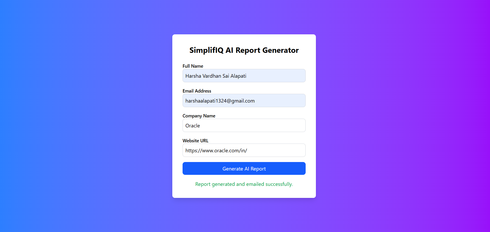
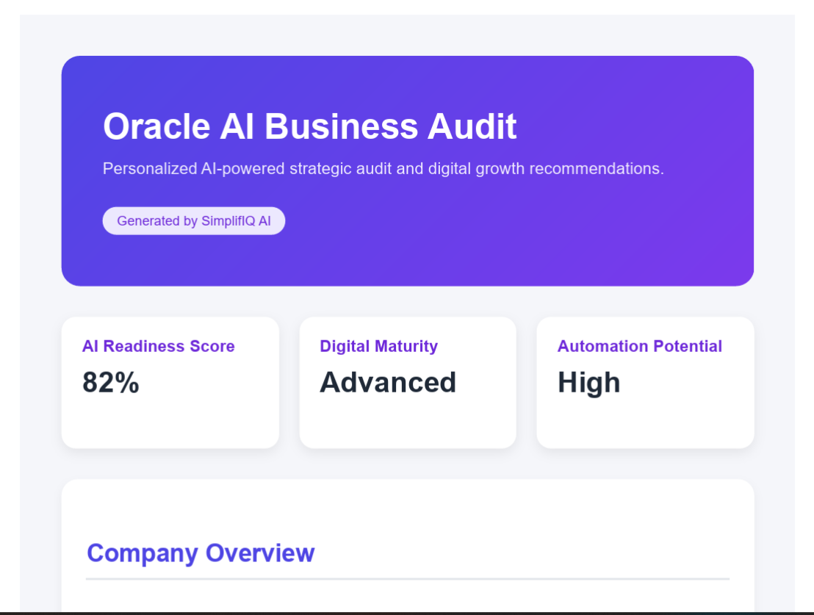
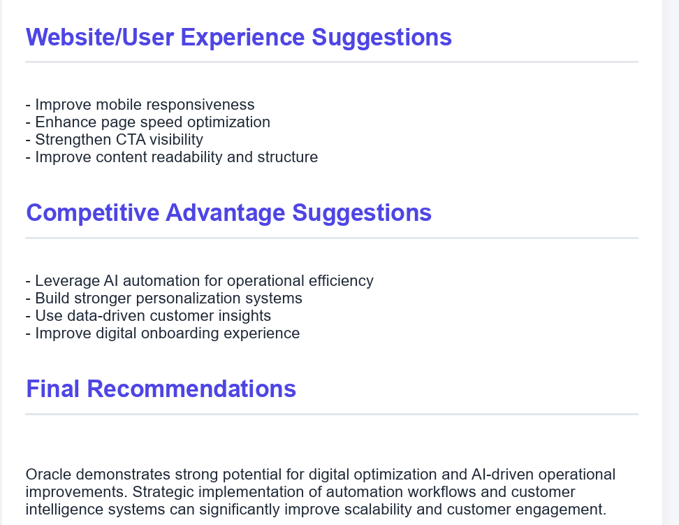
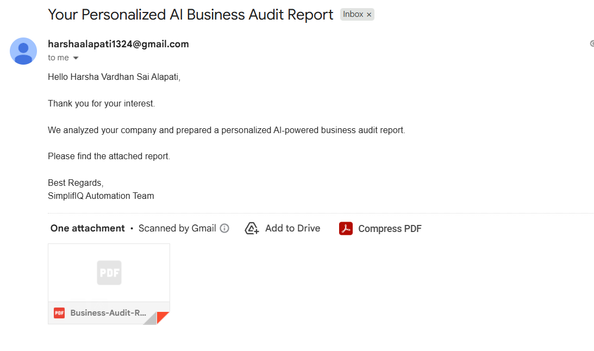

# SimplifIQ AI Lead Intelligence Automation

An AI-powered automated lead intelligence and business audit generation platform built for the SimplifIQ AI Software Developer Intern Assessment.

## Overview

This project automates the entire lead engagement workflow:

1. User submits company details through a web form
2. System scrapes company website information
3. AI-powered business audit report is generated
4. Professional PDF report is created
5. PDF is automatically emailed to the prospect

The goal is to simulate a personalized AI-powered first interaction for businesses.

---

# Features

* Modern React + Tailwind frontend
* Automated lead form workflow
* Website scraping with fallback handling
* AI-generated business insights
* Professional PDF report generation
* Automated email delivery
* Error handling and fallback systems
* Responsive UI

---

# Tech Stack

## Frontend

* React
* Vite
* Tailwind CSS
* Axios

## Backend

* Node.js
* Express.js

## Automation & Services

* Puppeteer
* Nodemailer
* Cheerio
* Axios

---

# Architecture Flow

User Form Submission
↓
Express Backend
↓
Website Scraping
↓
AI Report Generation
↓
PDF Generation
↓
Email Delivery

---

# Project Structure

```bash
simplifiq-ai-assessment/
│
├── client/
├── server/
│   ├── controllers/
│   ├── services/
│   ├── routes/
│   ├── templates/
│   ├── generated-reports/
│   └── server.js
│
├── README.md
└── .gitignore
```

---

# Setup Instructions

## Clone Repository

```bash
git clone <your_repo_url>
```

## Frontend Setup

```bash
cd client
npm install
npm run dev
```

## Backend Setup

```bash
cd server
npm install
npm run dev
```

---

# Environment Variables

Create `.env` inside `server/`

```env
PORT=5000

EMAIL_USER=your_email@gmail.com
EMAIL_PASS=your_gmail_app_password
```

---

# Screenshots

## Landing Page



---

## Generated PDF





---

## Email Delivery

---

# Error Handling

The system includes:

* scraping fallback handling
* API failure handling
* email error handling
* graceful workflow continuation

---

# Future Improvements

* Full Gemini/OpenAI integration
* Google Sheets logging
* Cloud PDF storage
* Authentication
* CRM integrations
* Advanced scraping pipelines

---

# Author

Harsha
